# Audit

## CSS
* Adding the bootstrap CDN for the bootstrap CSS File. Before the CDN, the page load was 45.91 seconds.
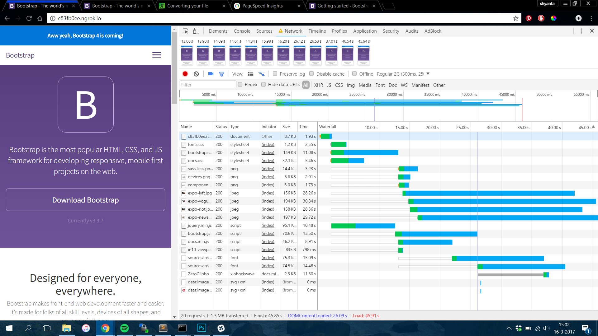
After adding the CDN, the loading time was reduced to 36.21 seconds.
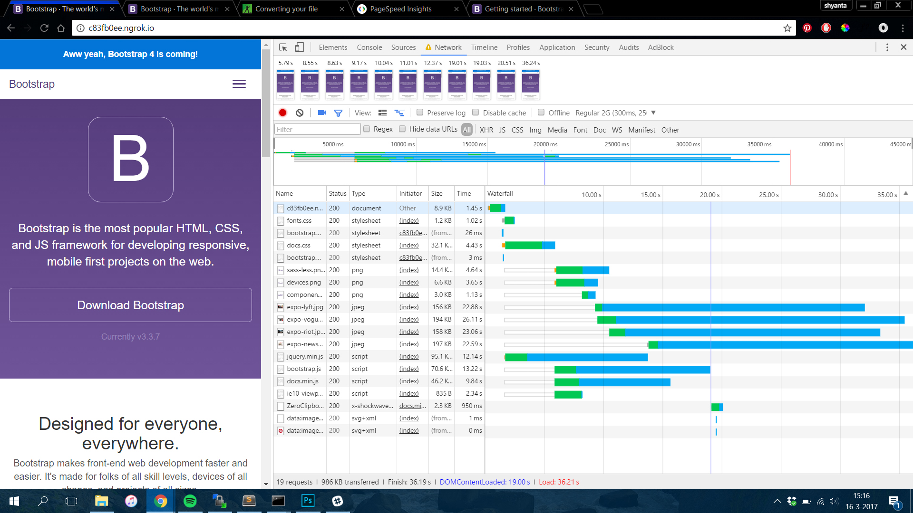
* I minified the CSS File, this reduced the loading speed to 32.88 seconds.
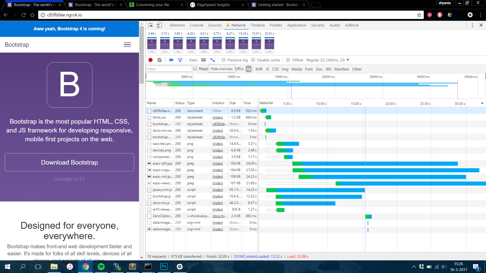
* I added a critical CSS and used LoadCSS to load the rest of the CSS'es later on.
This reduced the loading speed to 33.09 seconds.
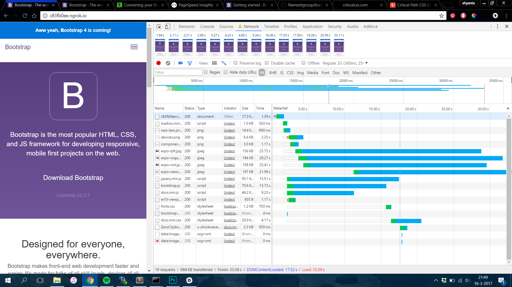

## JS
* Adding the bootstrap CDN for the bootstrap JS File. Before the CDN, the page load was 42.71 seconds.
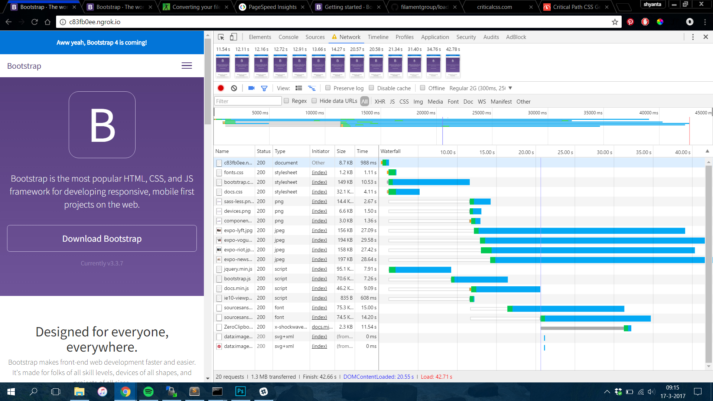
After adding the CDN, the loading time was reduced to 40.70 seconds.
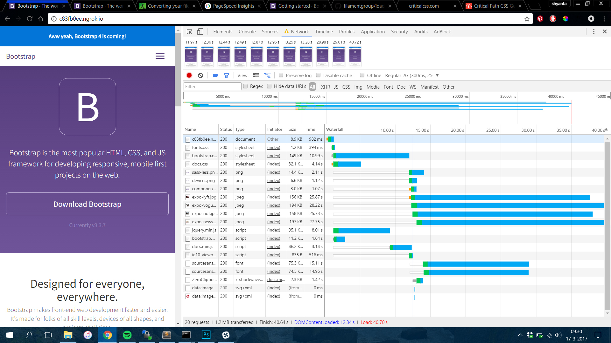
* I added Compression to the page. On each request it will compress the files. This reduced the page load to 32.05 seconds.
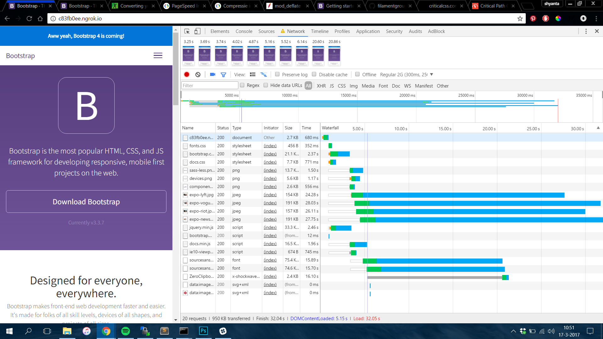

## Images
* The images used on the homepage are ~200kb each. This can be much better. The loading time right now is 41.97 seconds.
By downsizing the images, you can speed up this process a lot.
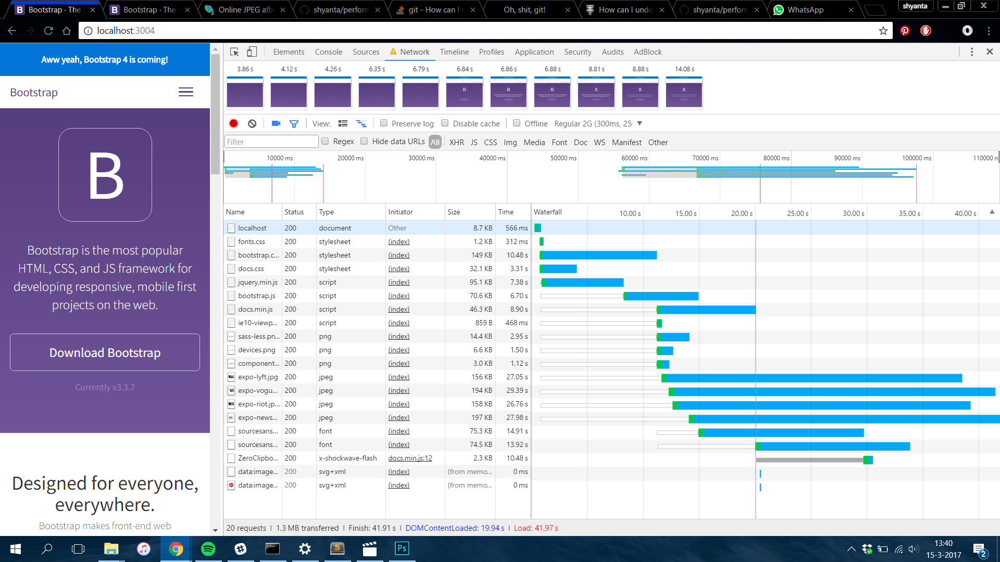
With the downsized images the pages has a loading time of 29.97 seconds.
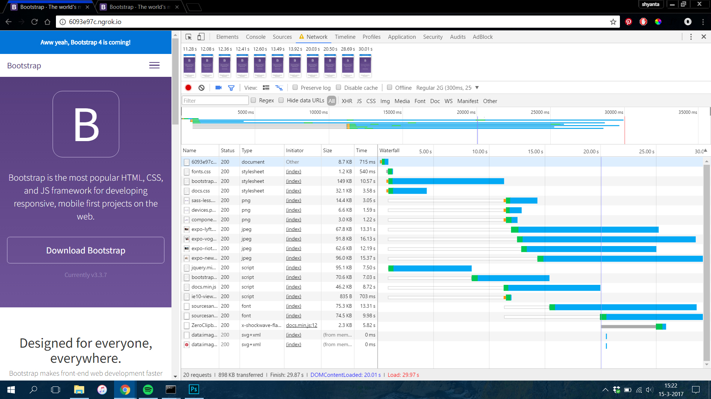
* Also, these images are about 800px - 600px, while they are used in a much smaller context. I scaled them down to 500px - 375px.
This move reduced the loading speed to 25.43 seconds.
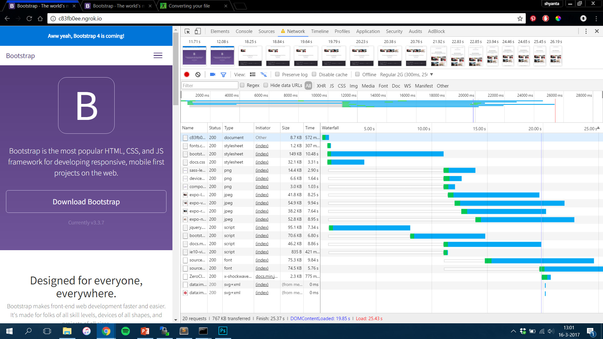
* To downsize the Images even more, I converted them from jpg to webp. This reduced the page load to 23.07 seconds.
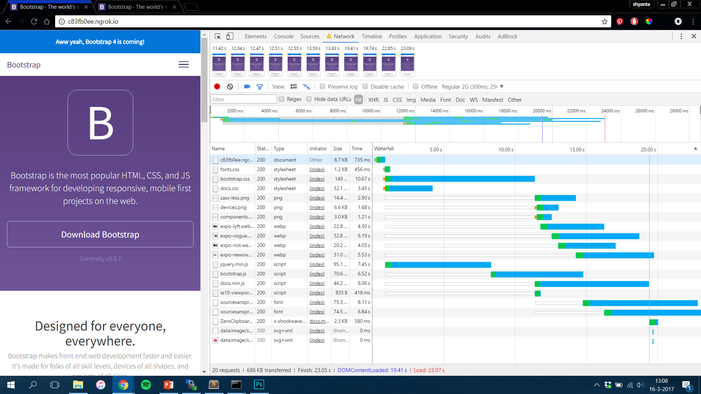
* Then I placed the images in a picture element.
