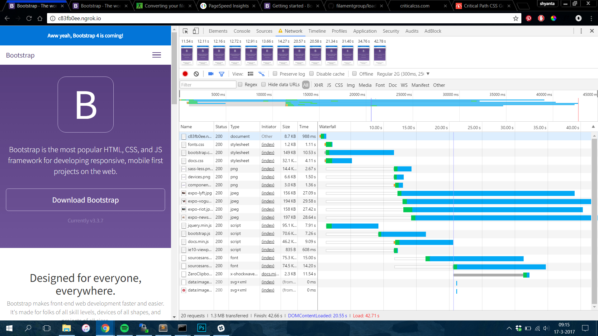
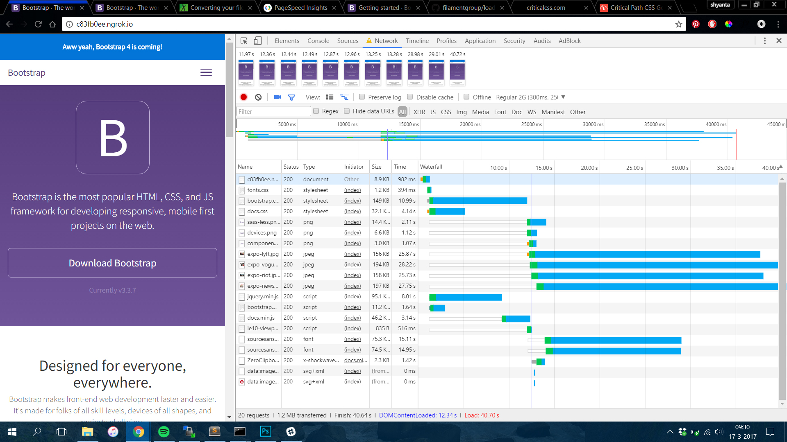
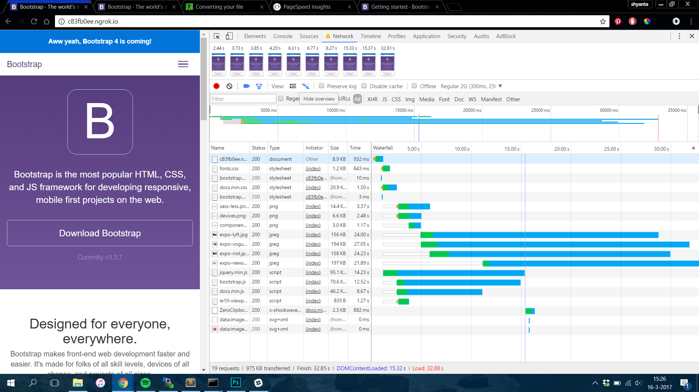
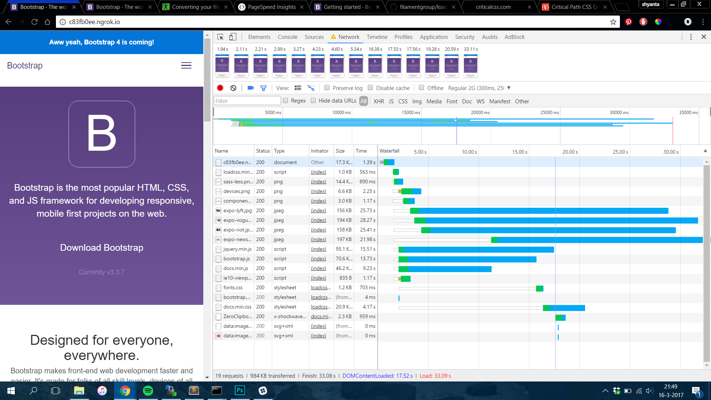

# Audit

## CSS
* Adding the bootstrap CDN for the bootstrap CSS File. Before the CDN, the page load was 45.91 seconds.

After adding the CDN, the loading time was reduced to 36.21 seconds.

* I minified the CSS File, this reduced the loading speed to 32.88 seconds.

* I added a critical CSS and used LoadCSS to load the rest of the CSS'es later on.
This reduced the loading speed to 33.09 seconds.
