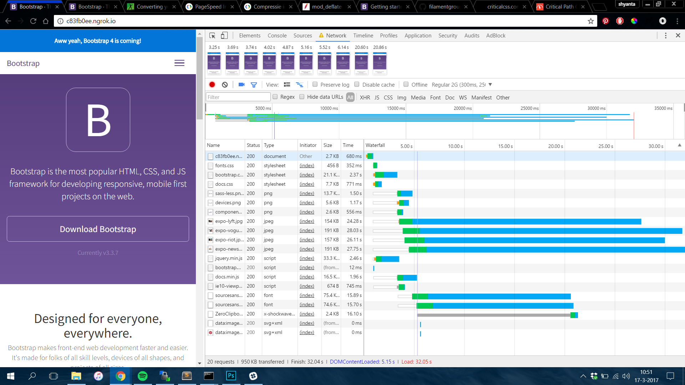

# Audit

<<<<<<< HEAD
## CSS
* Adding the bootstrap CDN for the bootstrap CSS File. Before the CDN, the page load was 45.91 seconds.

After adding the CDN, the loading time was reduced to 36.21 seconds.

* I minified the CSS File, this reduced the loading speed to 32.88 seconds.

* I added a critical CSS and used LoadCSS to load the rest of the CSS'es later on.
This reduced the loading speed to 33.09 seconds.

=======
## JS
* Adding the bootstrap CDN for the bootstrap JS File. Before the CDN, the page load was 42.71 seconds.

After adding the CDN, the loading time was reduced to 40.70 seconds.

* I added Compression to the page. On each request it will compress the files. This reduced the page load to 32.05 seconds.

>>>>>>> OptimizeJS
